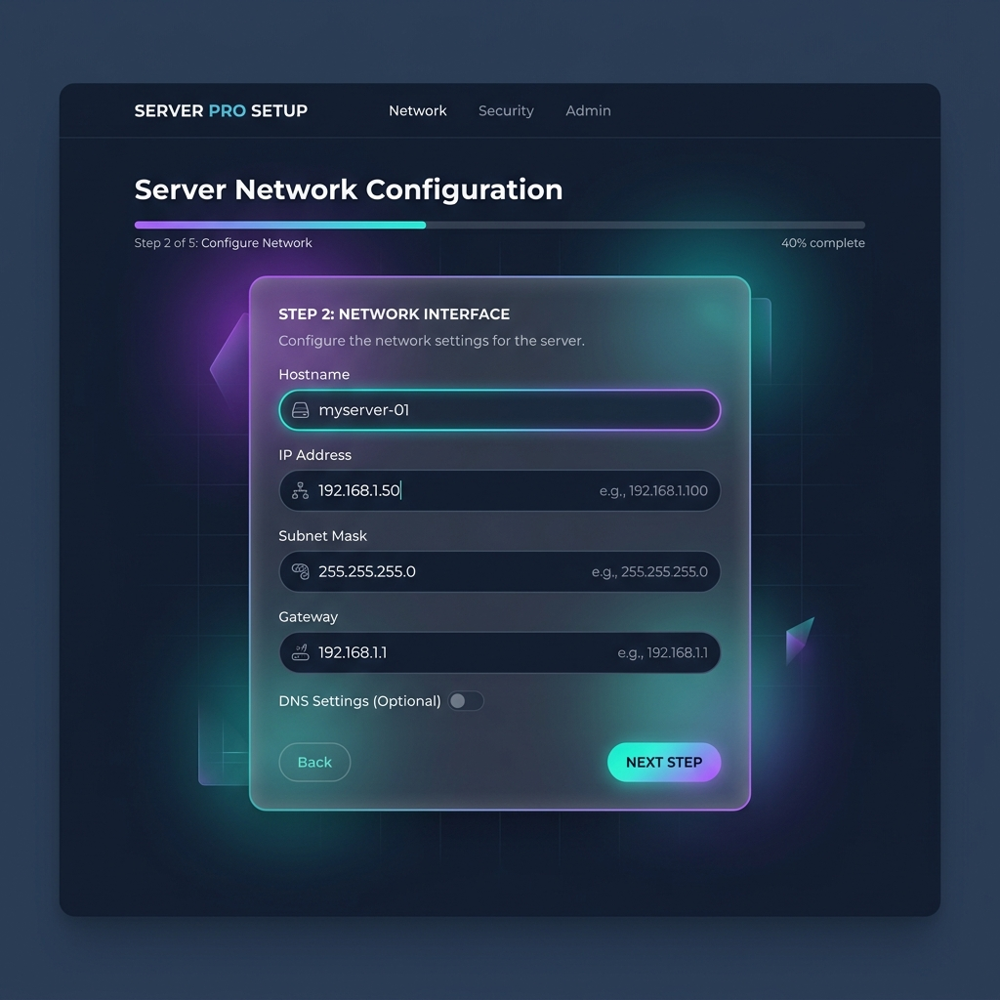

# OSBal (Open Source Loadbalancer)

OSBal is a modernized, open-source load balancer stack and configuration manager. It provides a premium web-based GUI to configure and manage a highly available layer 7 network appliance running **HAProxy**, **Keepalived**, and **Stunnel4** on physical bare-metal servers, virtual machines, or low-cost hardware like the **Raspberry Pi**.

---

## UI Screenshots

### 1. Unified Analytics & Diagnostics Dashboard


### 2. Network Interface Setup Wizard


---

## Core Goals & Capabilities

* **Commercial-Grade Alternative**: A free, open-source alternative to closed-source hardware load balancers and virtual appliances.
* **Ease of Configuration**: Configure load balancing routing, SSL termination, and high-availability failover directly from a web browser without needing to manually edit complex config files.
* **Low Footprint**: Runs comfortably on minimal hardware (e.g. Raspberry Pi or any VM with 1GB to 2GB RAM).
* **Modern Security**: Secured using PHP session guards and modern bcrypt password hashing.

---

## Technical Stack

* **Load Balancer (Proxy)**: [HAProxy](https://www.haproxy.org/) (Layer 7 HTTP and TCP proxying)
* **High Availability**: [Keepalived](https://www.keepalived.org/) (Active-Passive VRRP VIP failover replacing legacy Heartbeat)
* **SSL Termination**: [Stunnel4](https://www.stunnel.org/) (SSL/TLS decryption wrapper)
* **Web GUI Webserver**: Apache2 with PHP 8.2+

---

## Getting Started (Production Installation)

### Step 1: Prepare Server Host
Set up at least one server running a modern Debian-based Linux distribution (e.g. **Ubuntu 22.04/24.04 LTS** or **Raspberry Pi OS**).
* For high-availability VRRP configurations, set up **two** identical nodes.
* Assure each node has a unique, static management IP in your private network subnet.

### Step 2: Install System Dependencies
Update your package listings and install the required server utilities:
```bash
sudo apt-get update
sudo apt-get install -y haproxy stunnel4 keepalived apache2 php php-cli php-json
```

### Step 3: Deploy the OSBal GUI
1. Clone this repository or download the release archive:
   ```bash
   git clone https://github.com/siefkencp/osbal.git /tmp/osbal
   ```
2. Move the files to Apache's default Document Root directory:
   ```bash
   sudo rm -rf /var/www/html/*
   sudo cp -r /tmp/osbal/* /var/www/html/
   ```
3. Establish correct ownership and directory permissions so that the Apache service (`www-data`) can write configurations:
   ```bash
   sudo chown -R www-data:www-data /var/www/html/
   ```

### Step 4: Configure system permission helpers (Optional)
To allow the PHP web interface to reload HAProxy or Keepalived configuration files, grant `www-data` sudo permissions for service control. Run `sudo visudo` and append:
```sudoers
www-data ALL=(ALL) NOPASSWD: /usr/bin/systemctl reload haproxy
www-data ALL=(ALL) NOPASSWD: /usr/bin/systemctl reload keepalived
```

### Step 5: Run the Web Installer Wizard
1. Open your web browser and navigate to the IP address of your load balancer (e.g., `http://your-server-ip/`).
2. The installation wizard will guide you through:
   * **System Check**: Checking if all binary dependencies are present.
   * **User Creation**: Configuring your admin dashboard username and password.
   * **Appliance Network**: Setting up management hostname and Virtual IP properties.
3. Once completed, you will be automatically redirected to the dashboard sign-in screen.

---

## Local Development & Testing

You can run and test the web interface locally on your development machine using PHP's built-in webserver:

1. Navigate to the repository root directory:
   ```bash
   cd osbal
   ```
2. Spin up the server:
   ```bash
   php -S localhost:8080
   ```
3. Access the GUI at `http://localhost:8080/`.

*Note: When running without root permissions, OSBal runs in **development fallback mode**. It saves credentials and compiled service settings in a local `osbal/config/` directory instead of writing to restricted `/etc/` system directories, preventing permission failures.*
